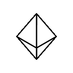

<h1>Hi there, My name is Rodolfo </h1>
<h3>Future enginner</h3>

    

    

I'm Rodolfo an engineering student. I'm passionate about technology, especially in backend development, databases, web and desktop applications. I like to explore new languages ​​like C, Python, Java, JavaScript.

<h3>Reach me out :</h3>

<!--
**rodolfo-rgb/rodolfo-rgb** is a ✨ _special_ ✨ repository because its `README.md` (this file) appears on your GitHub profile.

Here are some ideas to get you started:

- 🔭 I’m currently working on ...
- 🌱 I’m currently learning ...
- 👯 I’m looking to collaborate on ...
- 🤔 I’m looking for help with ...
- 💬 Ask me about ...
- 📫 How to reach me: ...
- 😄 Pronouns: ...
- ⚡ Fun fact: ...
-->
